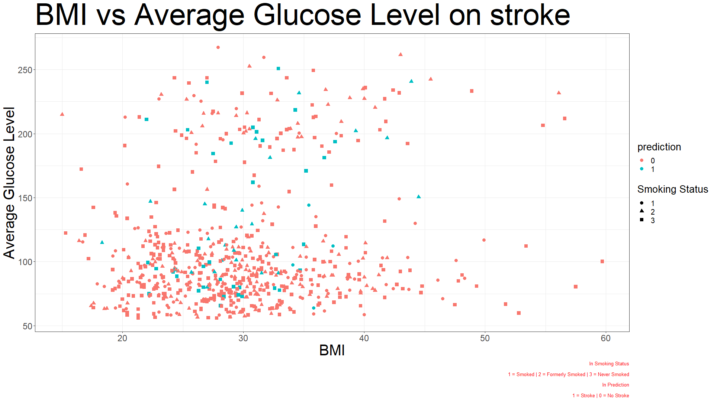
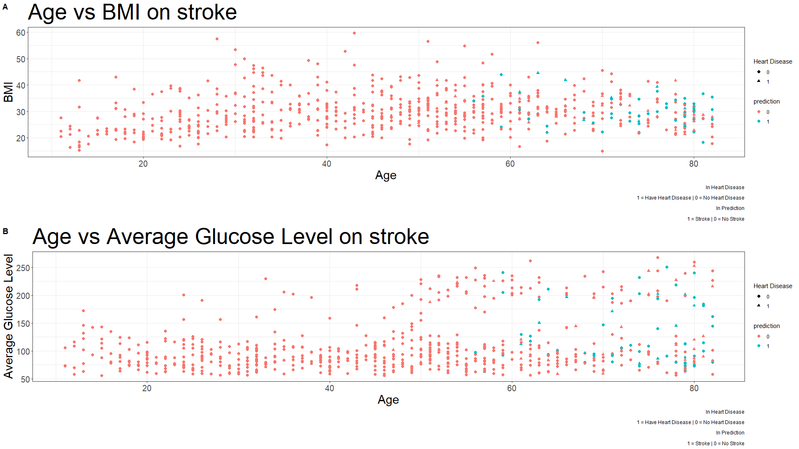
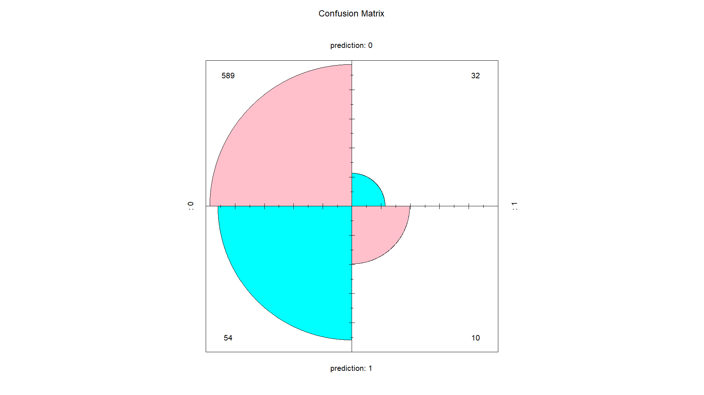
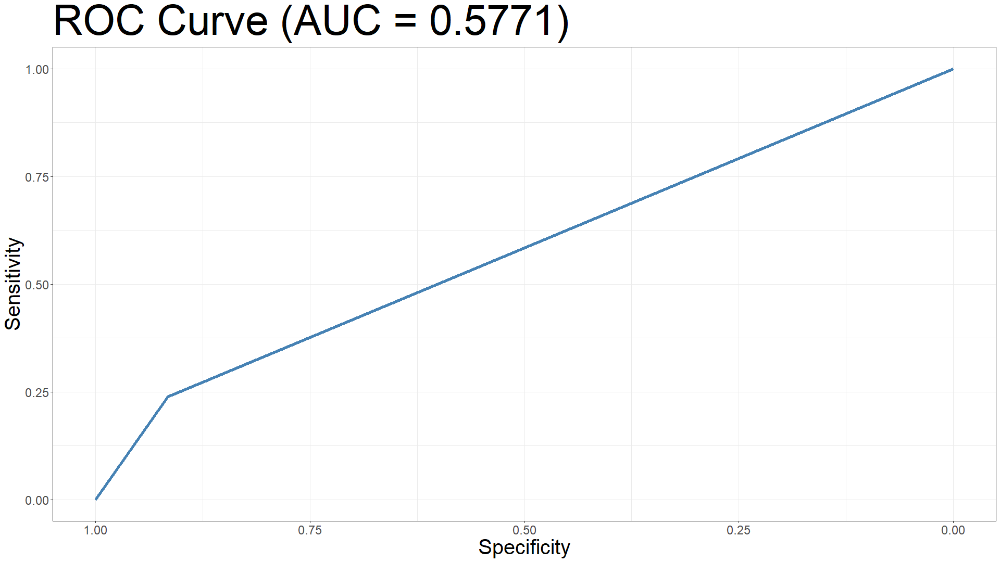
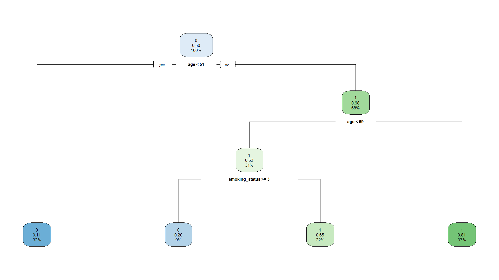
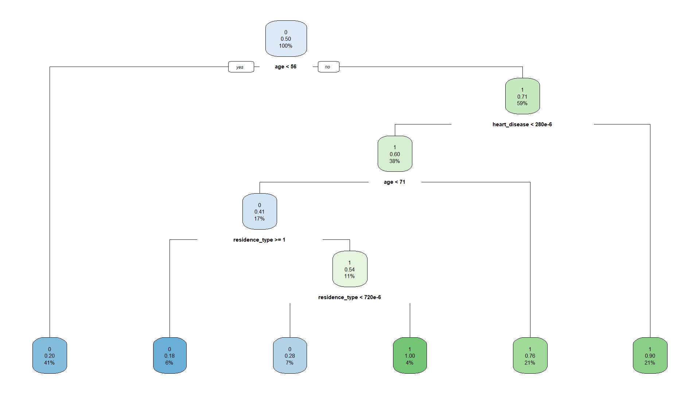
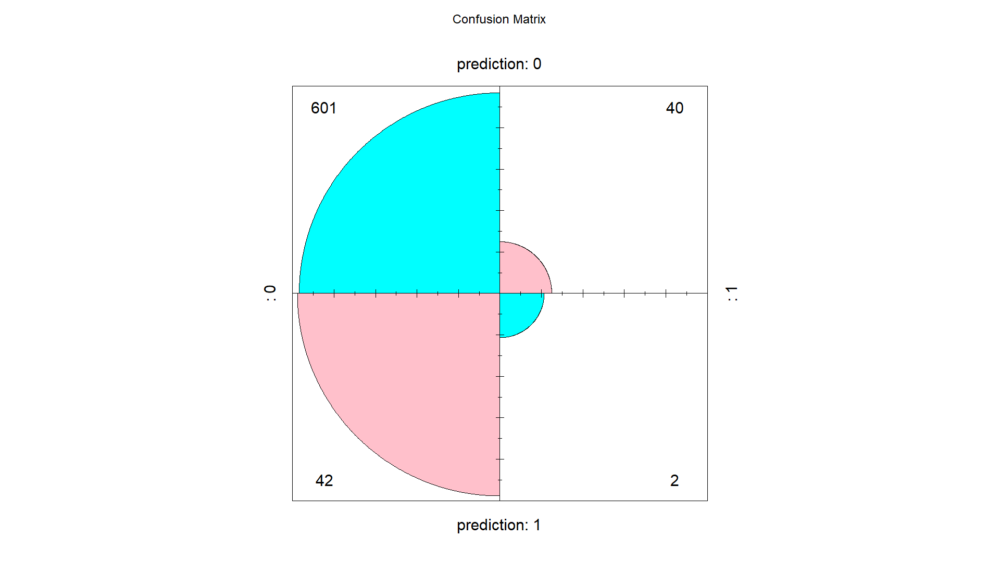
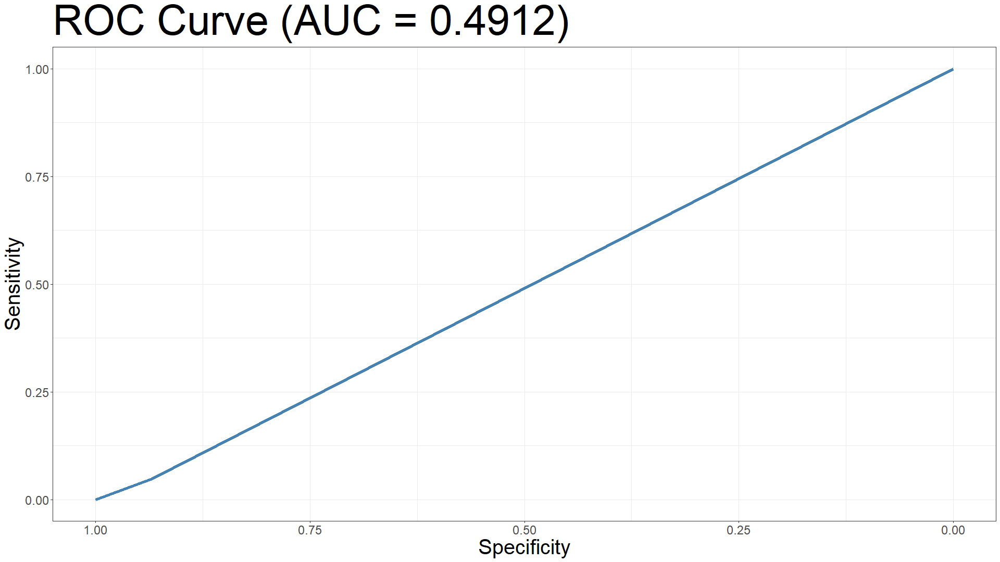

# Stroke Prediction


Prediction of stroke using Support Vector Machine (SVM) and Decision Tree (DTREE).

## Tech Stack


## About

The stroke deprives person's brain of oxygen and nutrients, which can cause brain cells to die. Numerous works have been carried out for predicting various diseases by comparing the performance of predictive technologies.

## Data Pipeline in R

```r
  data_clean = df %>%
    drop_na() %>%
    janitor::clean_names()
```

## About Dataset

According to the World Health Organization (WHO) stroke is the 2nd leading cause of death globally, responsible for approximately 11% of total deaths.
This dataset is used to predict whether a patient is likely to get stroke based on the input parameters like gender, age, various diseases, smoking status, etc. Each row in the data provides relavant information about the patient.
The class parameter is the stroke which is inputed as 1 and 0. 1 = Stroke and 0 = No Stroke. There was a huge imbalance in class data so sampling was implemented.

## Data Cleaning

 - Values like - N/A, Other and Unknown are removed.
```r
  data_clean = df %>%
    na_if("N/A") %>%
    na_if("Other") %>%
    na_if("Unknown") %>%
    drop_na() %>%
```
 - ID column is also removed.
```r
  subset(select=-c(id)) %>%
```
 - Other character columns are changed into numbers.
```r
  data_clean$smoking_status[data_clean$smoking_status == "smokes"] = 1
```
 - All data types are converted to numeric.
```r
  data_clean$age = as.numeric(data_clean$age)
```

## Support Vector Machine (SVM)

SVM works by mapping data to a high-dimensional feature space so that data points can be categorized, even when the data are not otherwise linearly separable. A separator between the categories is found, then the data are transformed in such a way that the separator could be drawn as a hyperplane. Following this, characteristics of new data can be used to predict the group to which a new record should belong.

Test accuracy achieved using SVM was 0.8745 or 87.45%. As the sampling was implemented, so during every run the accuracy changes but remains in the range of 80% - 90%. 

#### Graph of BMI vs Glucose Level



#### Graph of BMI and Glucose Level by age



## Confusion Matrix SVM



## ROC Curve SVM 



## Decision Tree (DTREE)

A decision tree is a non-parametric supervised learning algorithm, which is utilized for both classification and regression tasks. It has a hierarchical, tree structure, which consists of a root node, branches, internal nodes and leaf nodes.

For the below dtree, CP = 0.016718 to decrease the complexity as nothing was visible with all the data.

Accuracy achieved using DTREE was 0.8803 or 88.03%. As the sampling was implemented, so during every run the accuracy changes but remains in the range of 80% - 90%.

#### Age and Smoke DTREE



#### Age Heart Residence DTREE



## Confusion Matrix DTREE



## ROC Curve DTREE



## Support

For support, find me 😂.

## Authors

- [@Onnamission](https://www.github.com/Onnamission)

## Acknowledgements

 - [Dataset](https://www.kaggle.com/datasets/fedesoriano/stroke-prediction-dataset)
